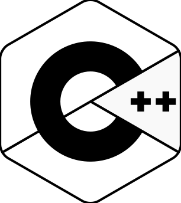
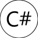
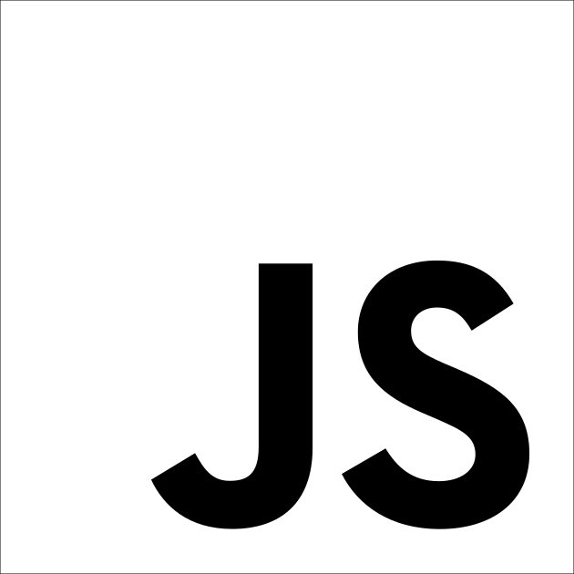
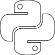
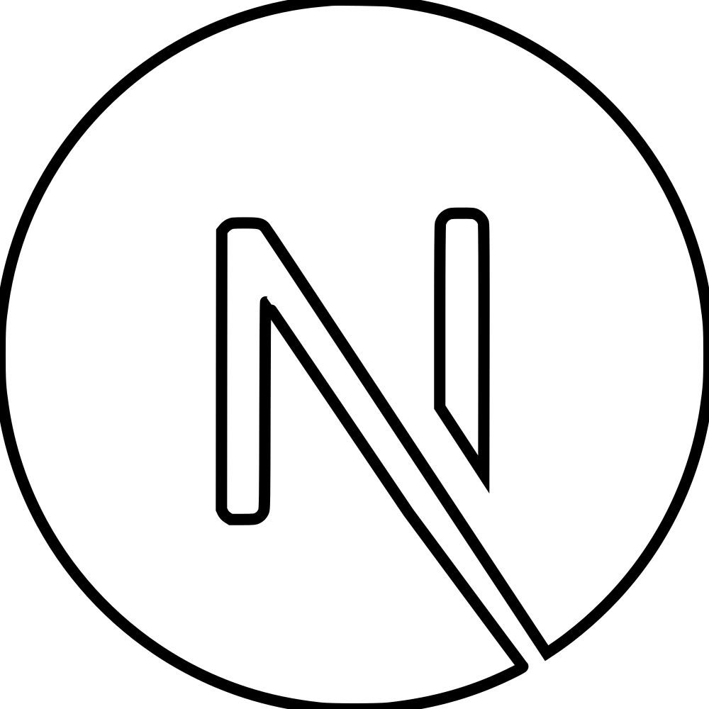

### Hello and, again, welcome to my profile

- I mostly code in C++, Rust, Python and JS/TS
- Everyday linux user and sometimes gamer
- I like doing stupid stuff

#### Some more notable projects of mine

|Name|Description|Language|
|----|-----------|--------|
|[wapanel](https://github.com/Firstbober/wapanel)|Desktop panel/bar for Wayland|GTK3, C++|
|[netcanv](https://github.com/liquidev/netcanv)|Contributed: textboxes, dark theme, and other stuff|Rust|
|[krita-rpc](https://github.com/Firstbober/krita-rpc)|Discord Rich Protocol for Krita|Krita, Python|
|[boberhole-server (v2)](https://github.com/Firstbober/boberhole-server)|Server for Boberhole, not really useful without a client 😄|Typescript|
|[pmOS for Wiko View](https://wiki.postmarketos.org/wiki/Wiko_View_(wiko-v12bnlite))| A port of postmarketOS for Wiko View| y e s |
|Boberhole v1|A simple all-in-one social platform in 2000's style|JS, HTML, CSS|

#### Some experiments or straight silly stuff

|Name|Description|Language|
|----|-----------|--------|
|[cpp-eval](https://github.com/Firstbober/cpp-eval)|eval() for C++|Python, C++|
|[kremowkuj](https://github.com/Firstbober/kremowkuj)|A Comes Virtual Machine implementation|Rust|
|[cpp-xmled](https://github.com/Firstbober/cppxmled)|JSX but for C++|Python, C++|
|[comes-adventures](https://github.com/comes-group/comes-adventures)|Adventures of COMES|Typescript|
|[comes-desktop](https://github.com/comes-group/desktop)|COMES desktop shell for Wayland|GTK3, C++|
|cpp-rusted|Port of some elements from Rust like Result and try!() to C++|C++|
|[Anime-Girls-Holding-Programming-Books](https://github.com/cat-milk/Anime-Girls-Holding-Programming-Books)|Contributed V language book| y e s |

#### Skills

 

<!--
**Firstbober/Firstbober** is a ✨ _special_ ✨ repository because its `README.md` (this file) appears on your GitHub profile.

Here are some ideas to get you started:

- 🔭 I’m currently working on ...
- 🌱 I’m currently learning ...
- 👯 I’m looking to collaborate on ...
- 🤔 I’m looking for help with ...
- 💬 Ask me about ...
- 📫 How to reach me: ...
- 😄 Pronouns: ...
- ⚡ Fun fact: ...
-->
