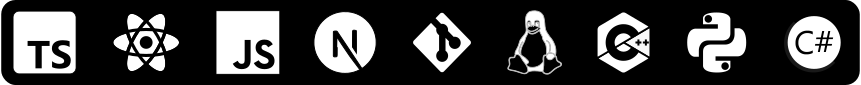

### Welcome

I am a self-taught full stack and desktop developer. I feel pretty good about using technologies such as React, Next.js, Typescript, Rust, Python and C++.

#### Applications

|Name|Description|Technologies|
|----|-----------|------------|
|[airqi](https://github.com/Firstbober/airqi)|Simple web app to look up air quality for your city|Next.js, Tailwind, Typescript| 
|[rasagi](https://github.com/Firstbober/rasagi)|Simple server powered RSS feed reader|Next.js, MUI, Typescript| 
|[wapanel](https://github.com/Firstbober/wapanel)|Desktop panel/bar for Wayland|GTK3, C++|
|[netcanv](https://github.com/liquidev/netcanv)|Contributed: textboxes, dark theme, and other stuff|Rust|
|[pmOS for Wiko View](https://wiki.postmarketos.org/wiki/Wiko_View_(wiko-v12bnlite))| A port of postmarketOS for Wiko View| - |
|Boberhole v1|A simple all-in-one social platform in 2000's style|JS, HTML, CSS|

#### Libraries and plugins

|Name|Description|Technologies|
|----|-----------|------------|
|[krita-rpc](https://github.com/Firstbober/krita-rpc)|Discord Rich Protocol for Krita|Krita, Python|
|[cpp-eval](https://github.com/Firstbober/cpp-eval)|eval() for C++|Python, C++|
|[cpp-xmled](https://github.com/Firstbober/cppxmled)|JSX but for C++|Python, C++|
|cpp-rusted|Port of some elements from Rust like Result and try!() to C++|C++|
#### Skills

 

<!--
**Firstbober/Firstbober** is a ✨ _special_ ✨ repository because its `README.md` (this file) appears on your GitHub profile.

Here are some ideas to get you started:

- 🔭 I’m currently working on ...
- 🌱 I’m currently learning ...
- 👯 I’m looking to collaborate on ...
- 🤔 I’m looking for help with ...
- 💬 Ask me about ...
- 📫 How to reach me: ...
- 😄 Pronouns: ...
- ⚡ Fun fact: ...
-->
